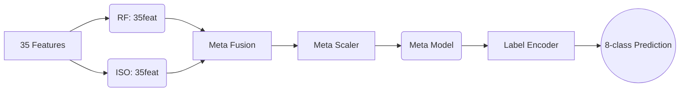

<div align="center">
  <h1>🛡️ Multiclass Network Intrusion Detection System (NIDS)</h1>
  <p>A machine learning-based intrusion detection system leveraging RandomForest, IsolationForest, and a Meta-Classifier to detect and classify 8 different types of network traffic in real-time.</p>
</div>

---

## 🏗️ Architecture

The system uses an ensemble approach to analyze network traffic:



### 🏷️ Traffic Classes

| Index | Class | Type | Description |
|:---:|:---|:---|:---|
| `0` | **Bot** | 🔴 Attack | Botnet activity |
| `1` | **Bruteforce** | 🔴 Attack | Brute-force login attempts |
| `2` | **DDoS** | 🔴 Attack | Distributed Denial of Service |
| `3` | **DoS** | 🔴 Attack | Denial of Service |
| `4` | **Infiltration** | 🔴 Attack | Network infiltration attempts |
| `5` | **Normal** | 🟢 Benign | Normal network traffic |
| `6` | **PortScan** | 🔴 Attack | Port scanning activity |
| `7` | **WebAttack** | 🔴 Attack | Web-based application attacks |

---

## 🚀 Setup & Installation

Follow these steps to get the server running locally:

### 1️⃣ Clone the Repository
```bash
git clone https://github.com/Santanu2003/NIDS_FinalYearProject.git
cd NIDS_FinalYearProject
```
## Downloading model Hugging Face

> **Note:** Make sure [Git LFS](https://git-lfs.github.com) is installed before cloning, 
> otherwise you'll get placeholder files instead of the actual model.
### Make models folder 
```bash
mkdir models
cd models
```
```bash

git lfs install
git clone https://huggingface.co/LazyPenitent/IntrutionDetection .
```
### 2️⃣ Create a Virtual Environment
```bash
python -m venv venv
```

### 3️⃣ Activate the Environment
**Windows:**
```cmd
venv\Scripts\activate
```
**Linux / macOS:**
```bash
source venv/bin/activate
```

### 4️⃣ Install Dependencies
```bash
python -m pip install -r requirements.txt
```

### 5️⃣ Run the Application
```bash
python app.py
```

> **Note**: Once running, open your browser and navigate to [http://localhost:5000](http://localhost:5000)

---

## 💻 Usage Guide

1. 🔐 **Register** an account at `/register`
2. 🔑 **Login** at `/login`
3. 📈 Navigate to the **Prediction** page
4. ▶️ Click **Start Replay** to begin simulating traffic
5. 📊 Watch the dashboard update in real-time with predictions
6. 📉 After the replay finishes, visit the **Analysis** page to view detailed metrics

---

## 📂 Model & Data Files
> ⚠️ **Warning**: Do not modify these files unless retraining the models.

### `models/` Directory
- `rf_model_35feat.pkl` — RandomForestClassifier *(35 features, 8 classes)*
- `iso_model_35feat.pkl` — IsolationForest *(35 features)*
- `meta_model_35feat.pkl` — LogisticRegression meta-classifier *(10 inputs, 8 outputs)*
- `meta_scaler_35feat.pkl` — StandardScaler for meta inputs
- `label_encoder.joblib` — LabelEncoder for 8 class names
- `selected_features_35feat.pkl` — List of 35 feature names in training order

### `data/` Directory
- `replay_demo.parquet` — CICIDS2017 replay dataset

---

## 📝 Key System Files

| File | Description |
|:---|:---|
| 🔧 `model_compat.py` | Scikit-learn compatibility patches (1.2.2 → 1.8.0) |
| 🧠 `inference.py` | Multiclass pipeline implementation |
| 🛠️ `utils.py` | Multiclass-aware Database schema and metrics |
| ⚙️ `app.py` | Replay handling, Multiclass flow, Socket.IO |
| 🖥️ `prediction.html` | Multiclass live dashboard view |
| 📊 `analysis.html` | Multiclass analysis and class distribution |

---

## 🆘 Troubleshooting

- **Models fail to load?** Ensure you have `scikit-learn >= 1.4.0` installed.
- **Parquet file error?** Make sure `pyarrow` is installed via pip.
- **Socket events not showing?** Check your browser's developer console for JavaScript errors.